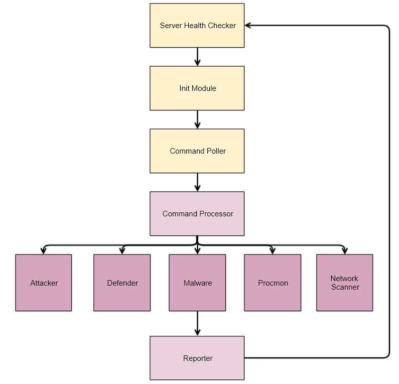

# BAScope: agent

## Introduction

사이버 공격 시뮬레이션 서비스인 `BAScope` 에서 공격 모듈의 역할을 하고 있는 agent 이다.  
웹 서버로부터 명령을 받아 해당 명령을 수행하고, 그 결과를 웹 서버로 보고하는 것이 핵심적인 기능이다.  


## Usage
- python3 가 설치되어 있어야 한다.
- Raw packet 전송 등을 위하여 관리자 권한으로 실행해야 한다.


### Prerequisites
```bash
sudo pip3 install -r requirements.txt
```
- 우선 Agent 실행에 필요한 파이썬 모듈들을 설치한다. 이 때, 위와 같이 관리자의 권한으로 설치하도록 한다.


### Configuration
- Agent 동작을 위해 Web Server 와 Tcp Server 의 IP 등을 적어주어야 한다.
- 이를 위해 config.py 에 해당 설정을 해줄 수 있다.
- 환경변수에 SERVER_IP 를 등록한 경우, 이를 서버의 IP 로 두고 실행을 시작하게 된다.


### Run
```bash
sudo python3 main.py
```
- Agent 를 관리자 권한으로 실행한다.
- Tcp 서버가 켜져 있으면 본격적으로 작동을 시작한다.
- Tcp 서버가 켜져 있지 않다면, 켜질 때 까지 기다린다.


## System Architecture 

- `agent.py` 에서 명령 받기, 보고서 전송 등의 전반적인 과정을 담당한다.
- `modules/*.py` 들이 공격, 방어, 스캐닝, 악성코드 등의 세부 기능을 담당한다.

